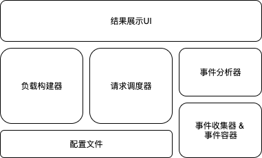

# 框架的测试目标

框架包含三大部分：
 * 负载模拟
 * 请求调度
 * 数据收集

## 框架的基本原理

本框架采用JMeter的设计思路，算是一个简易版本的JMeter：

建立一个线程池，多线程运行测试用例产生大量负载，在运行过程中，框架记录每次请求的时长，并发送相关事件到事件收集器，然后通过事件分析器分析数据，并展示到前台。

当前需求比较简单，就是记录每个请求的时长。

涉及到5个主要的模块：

* 负载构建（器）
* 请求调度（器）
* 事件收集（器）& 事件容器
* 事件分析（器）
* UI展示

UI展示模块采用前后端分离的方式，整个测试工具会内置一个Web服务器（Tomcat或者Jetty）。这个功能等有机会了再进行。目前，采用AB Tools的方式，执行完所有的测试用例后，直接输出测试的结果。

### 测试框架的系统结构

* 系统顶层结构图

  

* 负载构建器结构图

  负载构建器，由以下几个组件组成：

  * 配置文件读取器（读取TestCase相关的配置信息）
  * 线程组(ThreadGroup)创建器
  * 测试数据读取器
  * 

* 请求调度器结构图

  * 配置文件读取器（读取线程调度相关的配置信息）
  * 线程启动管理器

* 事件分析器结构图

* 事件收集器结构图

  * 容器初始化
  * 

### 负载构建器

  * 把“测试用例”写到独立的“测试用例文件”中。一个测试用例就是一个JSON对象。当前框架，暂时提供HTTP的请求。

    `{`

    ​    "testCaseName": "获取用户的DutyDate",

    ​    "protocol":"HTTP",

    ​    "url": { 

    ​        "host":"10.29.140.1",             // 应该是通用的参数，估计整个测试用例都可能使用同一个host

    ​        "port":"9000",                       // 同“host”，是否应该放到“commont”的段落里？

    ​        "service":"underwritting",  // 同“host”，改成参数引用更具通用性

    ​        "path":"/dutydate/{cuid}"

    ​    },

    ​    "method":"GET",

    ​    "parameters": {

    ​        "cuid":'xxxxx-dsfsfd-woislis-kfsjfa"

    ​    },

    ​    "needReadResponse": true // 是否需要解析返回结果，结果用于“后续”元件的输入

    `}`

  * 测试用例中有参数化的需求，可以通过"配置元件"或者"前置处理器"来完成

  * 有关联需求，可通过"后置处理器"来完成

  * 想要设置运行场景，如模拟多少用户，运行多长时间，可以设置"线程组"

  * 想要模拟并发场景，可以利用"定时器"来设置

  * 想要控制业务的执行逻辑，如登录操作只运行一次，可以使用控制器来完成

#### 相关概念

* 测试用例

  在JMeter中，就是“取样器”。但是并不好理解，在我们自己的框架中，直接叫做“测试用例”，直接对应QA的一个Test Case，直观明了。

  举个例子：一个测试用例就是测试一个API，也就是一个Http Request；一个测试用例也可能包含多个API，多次HTTP Request。

  一个“测试用例”，会封装成Java的线程对象，并赋予一个名称，这个很重要。

* 测试用例组

  多个“测试用例”组成，这些“测试用例”组成一个测试场景。多个测试用例之间可能存在一定的相互依赖关系。

* 配置元件

  就是每个“测试用例”包含的各个部分。具体包含如下内容： 

  * 请求使用的协议。例如：HTTP, HTTPS, TCP等等
  * 请求发送目的地的URL。这个可以拆分成2部分：
    * Domain_Name  ( Host_Name/IP + Port_Number)，如：shopex.homecredit.cn
    
    * Request Path，如：/suning/phone/iPhone/11
    
      Domain_Name 与 Request Path组合成一个完整的请求URL，或者EndPoint。
  * 请求方法，如：GET，POST，PUT，DELETE等等。如果是TCP，没有这个选项。
  * 请求参数（GET：URL上的参数；POST/Update：Body），设置一段JSON。如果是GET，框架会自动转成K-V的形式，放到URL上；如果是POST等请求类型，会完成的把JSON放到Body里传过去。

* 前置处理器

  “前置处理器”也是JMeter中的概念，当JMeter的“取样器”发起请求前，可以用这做一些工作，比如参数化等等。我们沿用JMeter的这个概念，可用于“线程组”中各个线程之间传递数据使用。

* 后置处理器

  “后置处理器”也是JMeter中的概念，当JMeter的“取样器”收到响应后做一些工作，比如提取响应报文中的内容。我们沿用JMeter的这个概念，可用于“线程组”中各个线程之间传递数据使用。

* 定时器

* 控制器

#### 负载模拟的主要参数

 * 设置总（Java）线程数
 * 设置线程数增长率。暂时采用线性增长的算法，易于实现。
 * 设置初始线程数(<=总线程数，需要校验)
 * 设置每个线程的业务数据 -- TODO: 应该从“参数”里删除。这个属于代码层级

### 请求调度器

请求调度的含义，简单的说，就是模拟用户量增长的过程。

请求调度器主要涉及如下一些参数：

### 事件收集

每个TestCase运行前，框架会创建一个Event对象，记录TestCase运行前的Timestamp数据；TestCase结束后，在此记录当前的Timestamp数据，然后把此Event对象发送给事件收集器。

#### 事件

事件应该有多种。

* 对于测试API的事件，都应该具备如下基本的信息：

`{`

​    "testCaseName": "获取用户的DutyDate",

​    “apiIdentify”:"用户登录",

​    "method":"GET",

​	"startTime": 98765492,

​    "endTime": 98876448

`}`

这就是最基础的事件定义对象。如果一个特定事情发生没有特别的需求，就可以采用这个基础的事件对象；如果有特殊的需求，则从这个基础事件扩展。

* 对于平台信息的事件，应具备如下的基本信息：

`{`

​    "cupUsage": "",

​    "memUsage": "",

​    "threads": ""

`}`

#### 事件收集器

事件生层后，会被收集到内存中。这个收集的过程，类似一个Map-Reduce的过程，会根据事件的类型、测试用例等维度进行分类。这些分类，都是针对（性能、负载、压力）测试的需求而定的。

目前不提供定制的收集器，框架内部内置一些收集器，针对我们当前设定的几种测试需求。

##### 性能测试事件收集器

性能测试主要针对如下几个指标：

* 整个系统的平均响应时间
* 具体某个API的平均响应时间
* 整个系统的吞吐量

针对上述指标，性能测试事件收集器的结构设计如下：

##### 负载测试事件收集器

需要提前输入期望的性能指标（系统平均响应时间、系统整体的吞吐量，这些指标预期值可能会超过“性能测试”得到的结果值）数据，然后统计一个核心指标：

* 最大用户数量

针对上述指标，负载测试事件收集器的结构设计如下：

##### 压力测试事件收集器

压力测试需要一开始，就迅速达到“最大”的负载，然后持续的进行系统调用。主要观察系统在极限负载的情况下，是否能长时间运行稳定，关注的核心指标是：

* 整体系统的平均响应时间（的“变化”）
* 某个API的平均响应时间（的“变化”）
* 极限用户数量（的“变化”）
* CPU使用率（的“变化”）
* 内存使用率（的“变化”）

针对上述指标，压力测试事件收集器的结构设计如下：

### 事件处理

## 几种测试的含义

 * 性能测试：
   

   模拟用户负载来测试系统在负载情况下，系统的响应时间，吞吐量等。
   （这里的负载指的是用户并发数）所以它的目的是为了获取系统的指标。
   

 * 负载测试：
   

   在一定的软硬件环境上，通过不断的加大负载来确定在满足性能指标情况下
   所能够承受的最大用户数。所以它的目的是为了获取最大用户数。
   一般不超过80%cpu，正常情况工作下最大用户数数据。
   

 * 压力测试
   

   也叫强度测试。
   在一定的软件硬件环境下，通过高负载的手段来使服务器资源处于极限的状态，
   测试该系统在极限状态长时间运行是否稳定。包括系统指标，服务器性能指标。
   

